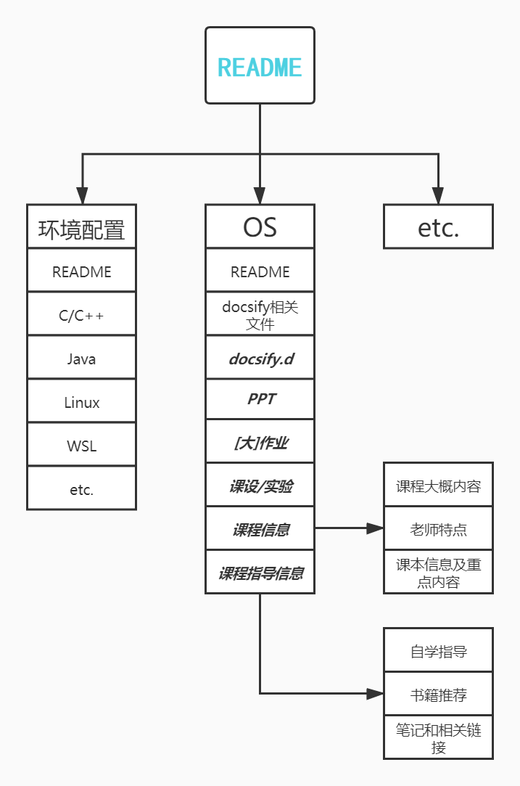

# SCU-CS

欢迎来到四川大学计算机学院公开仓库

## 起源

>   想法的起点来自2021年春季学期末正选阶段国际周、培养计划不清晰等问题的暴露。

`海纳百川` 却不方便容纳仅该有一个统一答案的问题有多个官方答案。

结合**李言荣**校长多次提到的**自学**精神和每年对于相同问题的回答（大家都是学计算机的，怎么都不能忘记复用的重要性吧），于此建立一个Organization来为做承上启下和信息资料分享。

## 实际问题

学习生活中，常有不同的问题：

-   Linux怎么装？
-   C/C++的环境怎么装？
-   xxx课主要讲什么内容？
-   xx课用什么教材？
-   我该如何学习xx？
-   插件怎么安装？
-   xx课/老师怎么样？

等同学间可以相互解决或周期性会出现的问题

## 介绍

该仓库为公开索引仓库，只包含具体内容的索引

>   所以应向其他分仓库提交，如果没有可以提[`Issue`](https://github.com/SCU-CS/README/issues/new/choose)

每个仓库应该至少包含如下内容：
1. 课程学习指导
  - 自学材料
  - 课程用书
  - 课程PPT(因为可能存在仓库过大，存储空间不够的问题 希望链接到自己仓库)
  - PDF(这事儿可能有风险，没给获取链接的，就悄悄用，给了获取链接或地址的，就可以随便用了)
  - 代码等相关材料
2. 选课指导(专业课程为主)
  - 选课顺序指导
  - 选课老师指导
  - 选课要求(争取)
3. 一些工具的配置与使用
4. 相关Q&A索引

## 电子书获取

主要三个途径
- [ZLibrary](https://z-lib.org/)
- GitHub/GitBook
  - <https://github.com/EbookFoundation/free-programming-books> 里面可以根据语言选择，比如中文和英语的包含内容就不一样
  - <https://github.com/justjavac/free-programming-books-zh_CN> 都是中文
- QQ群（诸如此类可以分享文件的平台）和一些散的链接（其他仓库或多或少会包含一些）
## 声明

> 一个人也许走得更快，但一群人走得更远

从心理还是希望能够团结互助，毕竟“大同”和“共产”都是共同的理想。

**认同与批判，便利与版权，平安与品茶，默许与删库，二者必有其一。**（借鉴@[skyleaworlder](https://github.com/TJ-CSCCG/TJCS-Course/blob/master/README.md#mega-%E5%A3%B0%E6%98%8E)）。

可能一些 pdf 不太适合上传，只能尽量多放一些资源。

## 免责

***商用禁止*** 大多数资料都是24小时学习版，除了写明了具体获取路径和同学们自制自主上传的文件。

- 仓库中所有文件，若侵，联系确认后立删
- 著作权只属于文件作者
- 拒绝未经允许的使用、分发、传播

## 结构图

蓝色**README**表示当前这个仓库；指向的每一块表示一个仓库，第一栏为相关的课程（可能跟实际的课程名不完全相同），其中粗斜体表示文件夹，其他均为文件（使用`Markdown`格式）。

## 贡献

1.  fork或者建分支之后发pr
2.  正确使用标点符号
3.  熟悉`markdown`语法
4.  图片放在`./image`下
5.  了解`docsify`（用于构建网页）
6.  更多详细点击[此处](Contribution.md)

[跳转至主页](https://github.com/SCU-CS)

